#**TYRE SIDEWALL INSPECTION**

##**1. OBJECTIVES**

This document describes the procedure on the usage for the Tyre Side Wall Stamping Inspection Application.

The 3D Camera is mounted to the Robot 6th Axis and Scan the Sidewall of the Tyre to capture the 3D Data of the Sidewall of the Tyre.

The 3D Data will be Inspected and the Application will shows the Results.

**HARDWARE :**

1. MONITOR :

        Connectivity: HDMI or DisplayPort

        Aspect Ratio: 16:9

        Resolution: 

        [Full HD (1920x1080) with 100% Display Scaling]   or
 

        [4K (3840x2160) with 200% Display Scaling]

2. DESKTOP PC :

        Processor: Intel or AMD

        Cores: Minimum 8 Cores with Minimum 16 Logical Processors

        Generations: Intel (12th Gen or Above); AMD (Ryzen5 or Above)

        Integrated Graphics: Intel UHD/XeGraphics or AMD Ryzen with Radeon Graphics

        SSD: 1TB; RAM: 16GB DDR4

        Ethernet: Intel Gigabit Ethernet Port (I219-V or Equivalent)

        USB3.0: Intel USB3.0 xHCI Compliant Host Controller Type-A

 **SOFTWARE:**

OPERATING SYSTEM :

        Windows 10 Pro or Windows 11 Pro; 64-Bit (x64)

QUALITY INSPECTION APPLICATION :

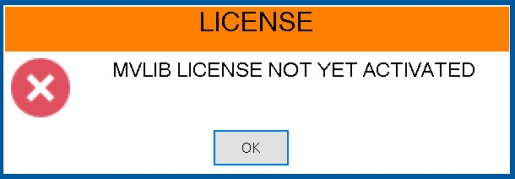

The full installation, including the operating system, will require approximately 50 GB of space on the C drive for the new PC.

##**2. SOFTWARE APPLICATION**

Open the Application which is located in Desktop.

 

Once the Application is opened, then Application will start. The Below Screen will appear for few seconds which will load all the settings required for the application.

 

If there are any warnings or error, the respective dialog box will be shown. 
After this screen is completed, the Login Screen will open.

##**2.1 LOGIN**

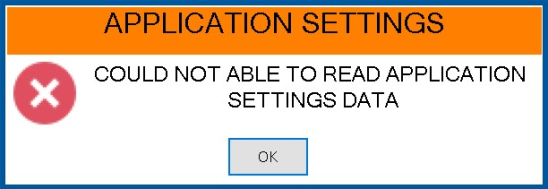 

    1.Click the i icon to open the User Manual.

    2.View the application version number in the bottom-right corner of the screen.

**Enter your username and password on the login screen.**

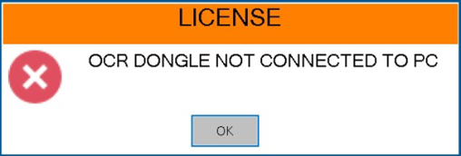 

    1.Click the Login button to access the application.

    2.Click the Exit button to close the application.

    3.The logged-in username will appear in the top-left corner of every screen from Dasboard.

**Contact the administrator for a valid username and password if needed.** 

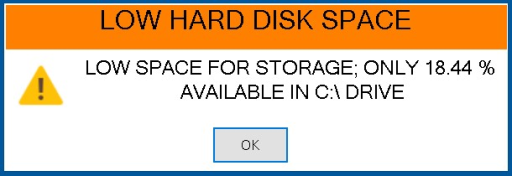 

##**2.2 DASHBOARD**

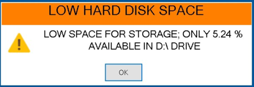 

**Settings          :** All the Settings for the Application are editable.

**User              :** Add/Delete/View the users for this application.

**SKU Management    :** Add/Delete/View the SKUs for this application.

**Marking Items     :** Add/Delete/View the Marking Items for each SKU

**Robot Program     :** Configure the robot for each SKU based on the requirement. The robot program for each SKU will be created automatically.

**Camera Program    :** Configure the Camera for each SKU based on the requirement

**Teaching Image    :** Add/Edit the Inspection Parameters for each SKU

**Inspection        :** Inspect the Components based on the configured Settings for each SKU.

**Alarms            :** View/Export the Alarms that are logged in this Application.

**Results           :** View the Result (PDF, Image, Individual Results) for each inspection Components

**Reports           :** View all the Results in a Single View with Statistical Analysis.

**IO Module         :** Monitors and controls the input and output signals, ensuring proper communication between external devices and the system.

**Scanner           :** A barcode device used to scan the barcode present on the tyre sidewall, enabling identification of the tyre.

**Database          :** A structured collection of data used to store and manage tyre inspection details. 

##**2.3 SETTINGS**

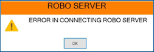 

**Data Location:** Click on BrowseFolder Button and Select the Folder where we need to save the Inspection Results.

**Inspection:** Enable or Disable this Functionality, so that if we need to save the original image which is been captured during inspection for every component.

**IP Addresses:**
    ROBOT     : IP address of the robotic system used for sidewall inspection.

    SAFETY PLC: IP address of the safety PLC (Programmable Logic Controller) responsible for safety operations.

    CAMERA    : IP address of the camera capturing inspection images.

    PC(ETH1)  : IP address of the primary Ethernet-connected PC for processing.

    PC(ETH2)  : IP address of the secondary Ethernet-connected PC for backup or communication.

**Database:**
    Server Host Name      : IP address of the database server used to store inspection data.

    Server Database Name  : Name of the database handling sidewall marking data.

    Server User Name      : Username used for database authentication.

    Server Password       : Password for database access (hidden for security).

    FPITyreData Table Name: Table used to write tyre inspection data into the database

##**2.4 USERS**

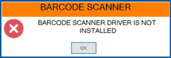 

You can **add new users**, **delete existing users**, and **view existing users**.

To add a **new user**, enter a username (up to 8 characters), a password (up to 8 characters), and select a role: **Administrator**, **Maintenance**, or **Operator**. 

Then, click the **Add User** button.

**Role Accessibility:**

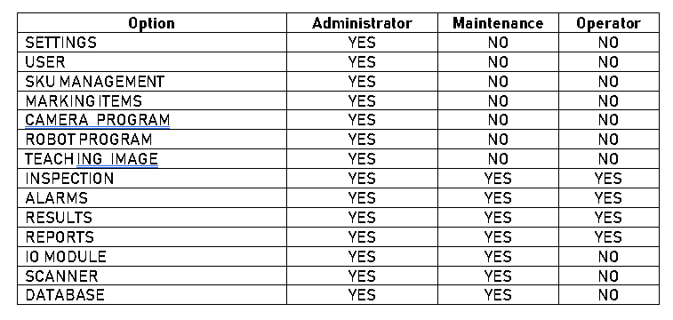 

##**2.5 SKU MANAGEMENT**

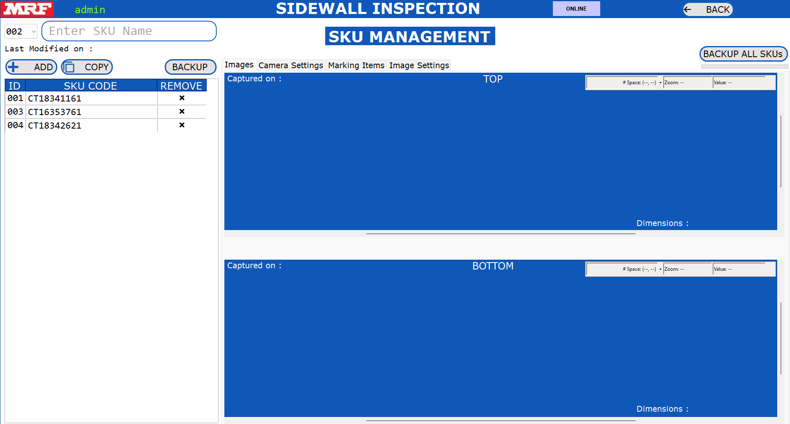 

**Accessible for:** Administrator

   You can create, delete, copy, or view an SKU.

**SKU ID:** This ID is used as Short-Code for SKU Name to access SKU using PLC, etc.

**SKU Name:** This is used as the name of the Item that has to be inspected.

**Create:** Select the SKU ID and enter the new SKU Name and click on **ADD** button. Special Characters and Existing SKU Names are not allowed to create new SKU.

**Delete:** Select the SKU.  Click on the ‘**x**’ mark. It will prompt dialog box to accept for the deletion of the SKU. Once it is deleted, it is deleted permanently and it is not possible to recover it back.

**Copy:** Select the new SKU ID and Enter the New SKU Code. Select the Existing Job and Click on **COPY** Button. After Copy is completed, the newly copied Job is appeared in the list.

**View:** All the Settings relative for the SKU will be visible in the main screen of this SKU Management.

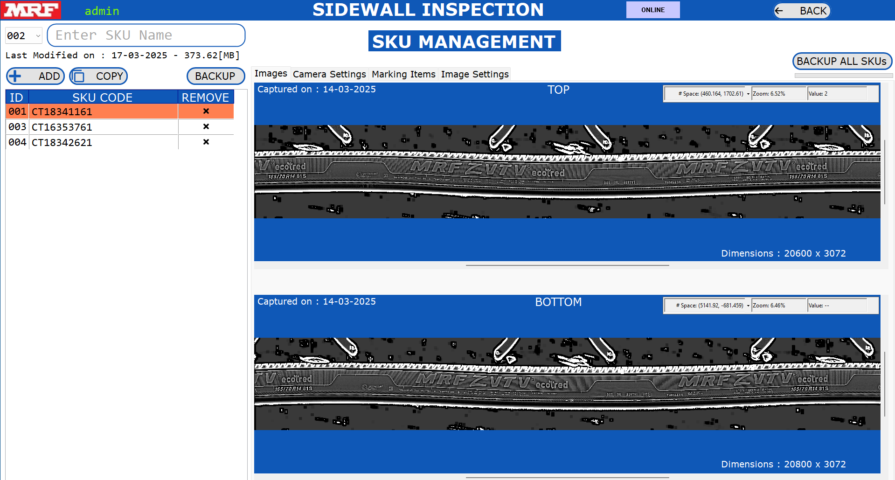 

The Settings that are visible for every SKU are:

    •	Images: Delete/View the Images which are captured as reference by the Camera.

    •	Image Settings: The inspection parameters are displayed in this section.

    •	Camera Settings: The camera settings for each SKU, such as the serial number
    ,                    IP address, etc., are displayed in this section.

    •	Marking Items: The naming conventions for the inspection parameters that have 
                       been configured are displayed in this section.

You can also delete individual settings by clicking the **DELETE** button.

##**2.6 INSPECTION**

Accessible for: **Administrator**, **Maintenance** and **Operator**.

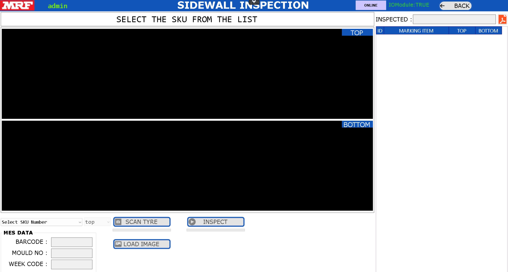 

•	Scan the Barcode present on the top side of the tyre to load  **SKU number**.

•	The settings linked to the selected SKU will be loaded into the application

•	**Administrator/Maintenance:** Will have an option to manually load the image to inspect the image.

•	**Operator:** Must press both the push button simulataneously to trigger the camera and inspect the image.

•	Check the two options on the top right side of the screen indicating the **ROBOT** and **IO-module** status. Both should be **Online** and **True** before inspecting the tyre.

•	While selecting the **SKU**, the **Top** Side option will be automatically selected during the first scan of the tyre. Once the image is ready, the inspection will occur for the top side and update the following:

    o   A new image with graphics will appear in the TOP of the screen for top side and
    BOTTOM of the screen for bottom side of the tyre.

    o   The inspection results for all tools will be updated on the right side of the screen
    under the TOP section.

    o   The PASS/FAIL counter will be updated on the right side of the screen under the TOP
    section.
 
**STEP-1 :** SCAN THE BARCODE TO LOAD THE RESPECTIVE SKU USING THE HANDLE SCANNER

 

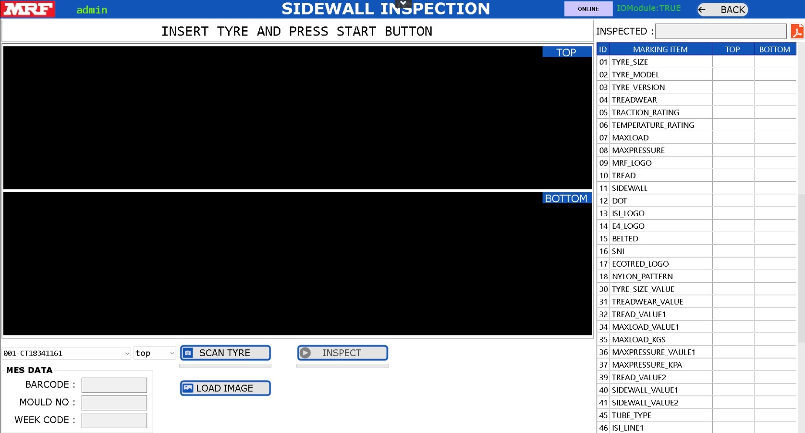 

**STEP-2 :** PRESS BOTH THE PUSH BUTTON SIMULTANEOUSLY TO SCAN AND INSPECT THE TYRE

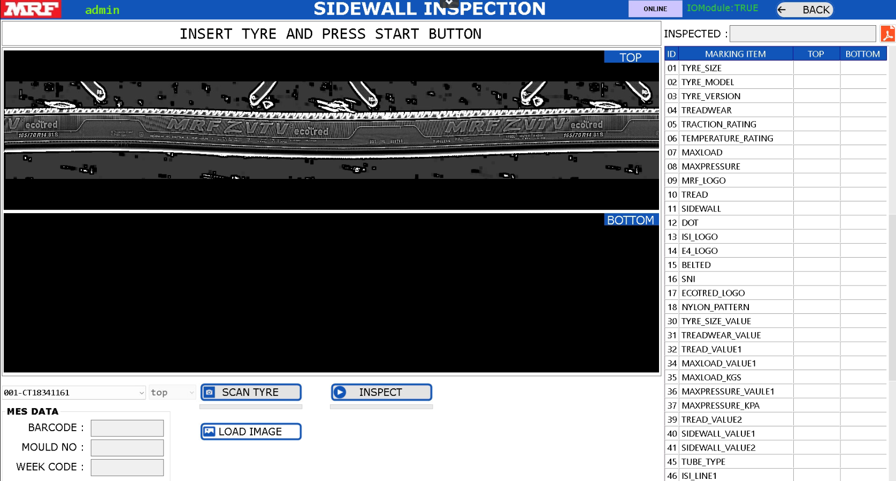 

**STEP-3 :** RESULTS WILL APPEAR ON THE RIGHT SIDE OF THE SCREEN

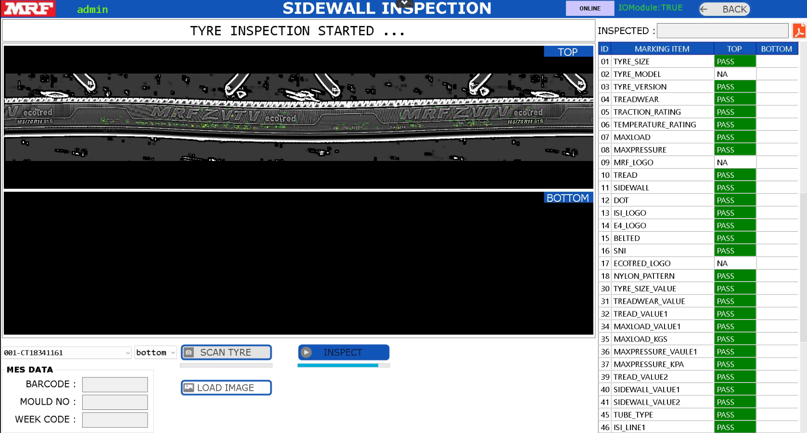 

**STEP-4 :** NOW FLIP THE TYRE TO SCAN THE BOTTOM SIDE 

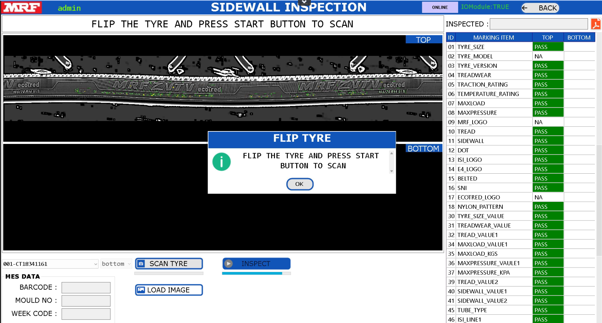 

The respective dialog box will appear, saying: **"Flip the tyre and press the Start button to scan."**

**STEP-5 :** PRESS BOTH THE PUSH BUTTON SIMULTANEOUSLY TO SCAN AND INSPECT THE TYRE

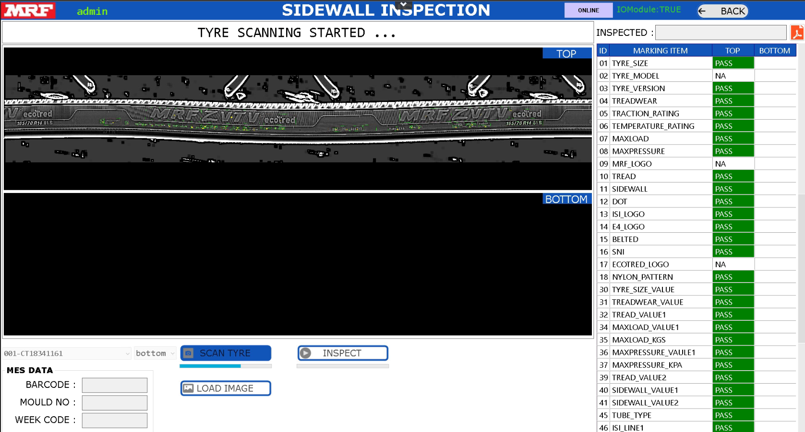 

**STEP-6 :** RESULTS WILL APPEAR ON THE RIGHT SIDE OF THE SCREEN

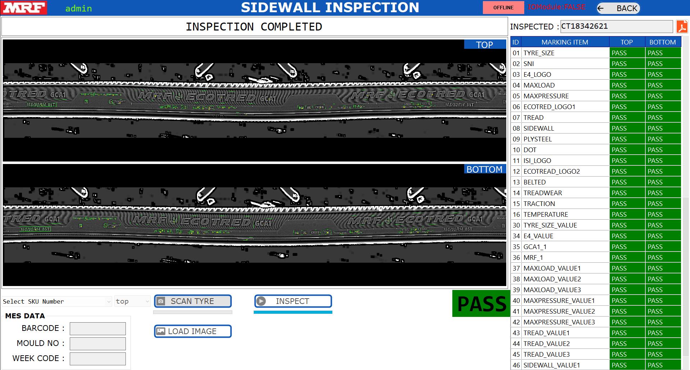 

##**2.7 ALARMS**

Accessible for: **Administrator**, **Maintenance** and **Operator**.

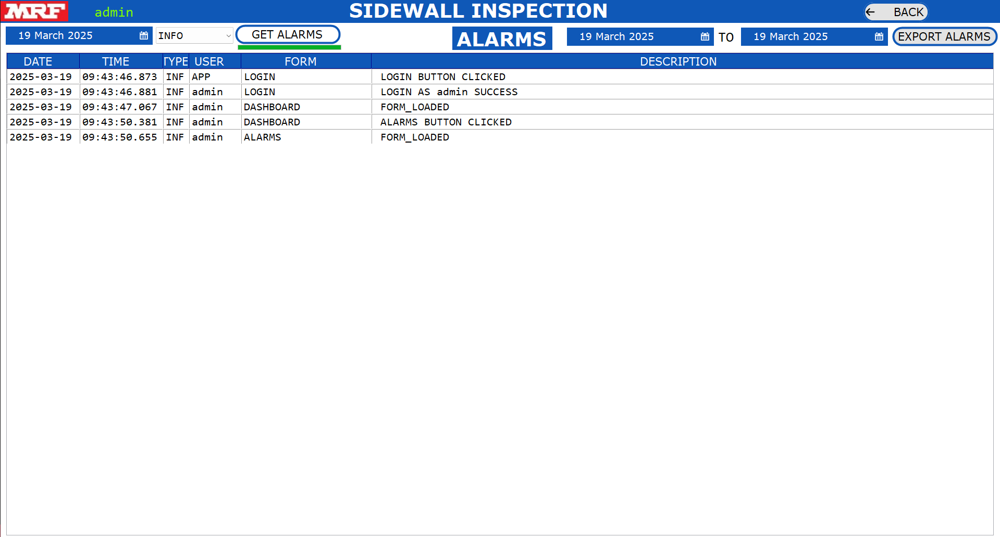 

Alarms will display all log information for the application.

•	Select Date and Select Type of Alarm 

•	Click on **GET ALARMS**  Button.

•	To export alarms, select the start date and end date, then click the Export Alarms button. The alarm data will be exported to the '**Data Location**' folder.

•	Click the  **BACK** Button to return to the Dashboard.

##**2.8 RESULTS**

Accessible for: **Administrator**, **Maintenance** and **Operator**.

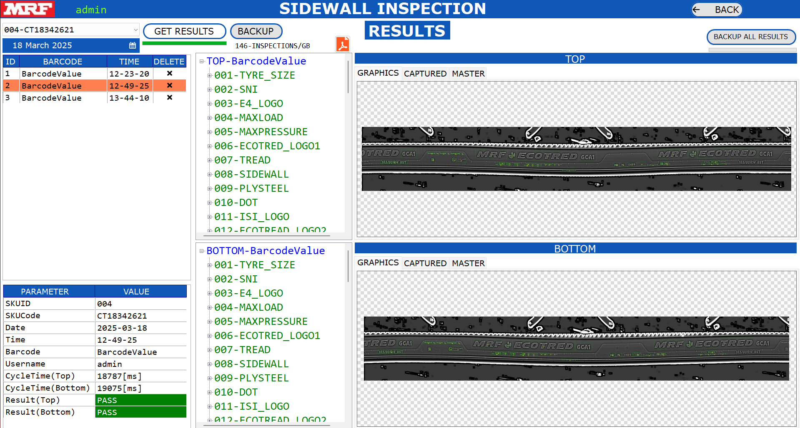 

•	Select the **SKU Number**.

•	Select the **Date**.

•	Click on **GET RESULTS** Button.

•	The Results will be Displayed in the List.

•	Click on the trigger number to view the result of the inspected object.

•	Click on **PDF ICON** to see the PDF report of the Inspection.

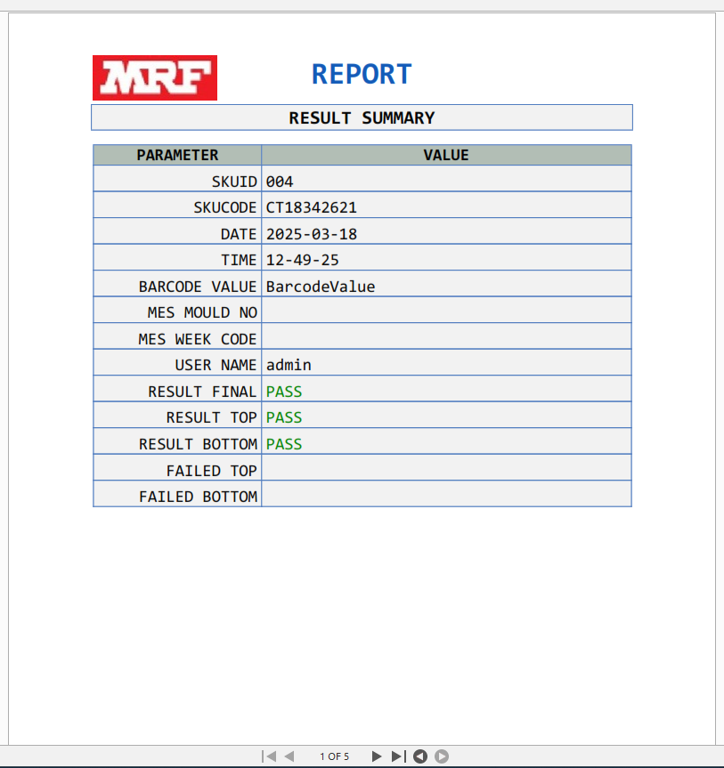 

•	Expand the Tree View to View the Full Inspection details of the inspected object.

•	The graphic image will be displayed in the center of the screen.

•	The metadata information about the inspected object is available at the bottom left corner of the screen.

•	Click the **BACK** Button to return to the Dashboard.

##**2.9 REPORTS**

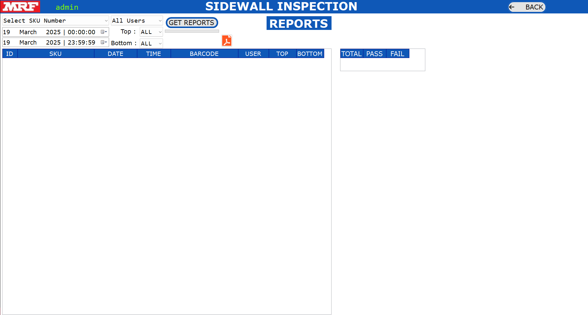 

Accessible for: **Administrator**, **Maintenance** and **Operator**.

•	Select the **SKU Number**.  

•	Select the **Start Date** and **End Date**. 

•	Select the **User Name**

•	Select the Result **PASS/FAIL/ALL**.

•	Click on **GET REPORTS** Button.

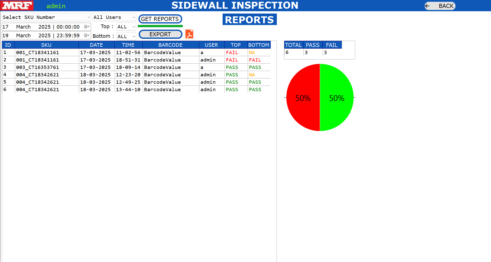 

•	The total, pass, and fail counts will be displayed in a table and also shown in a pie chart.

•	The Failed Details will be shown in Table.

•	The results of all inspection details will be updated in the list.

•	Click the **EXPORT** button to export the list of all inspection details to a CSV file in the Data Location folder.

•	Click on the **Trigger number** to view the result of the inspected object.

•	Click on the **PDF icon** to view the PDF report of the inspection.

•	Click on **BACK**  Button to return to the Dashboard.

•	Select the trigger details to view the history of all inspection results in graph form.

##**2.10 IO MODULE**

Monitors and controls the system's inputs and outputs, including sensors, buttons, and lamps, ensuring proper machine operation during tyre inspection.

Click on connect button to get connected to the IO module.

 

##**2.11 SCANNER**

This option is used to establish connectivity with the scanner and retrieve barcode details.

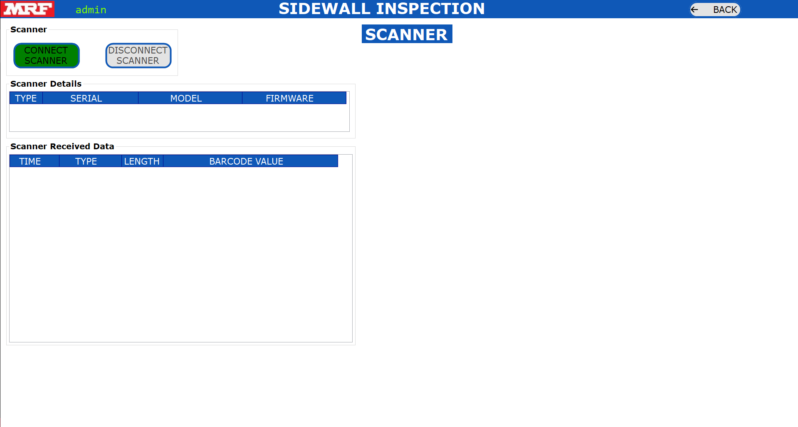 

##**2.12 DATABASE**

This option is used to check the database connectivity based on the details entered in the Settings section, including the server IP, database name, username, and password.

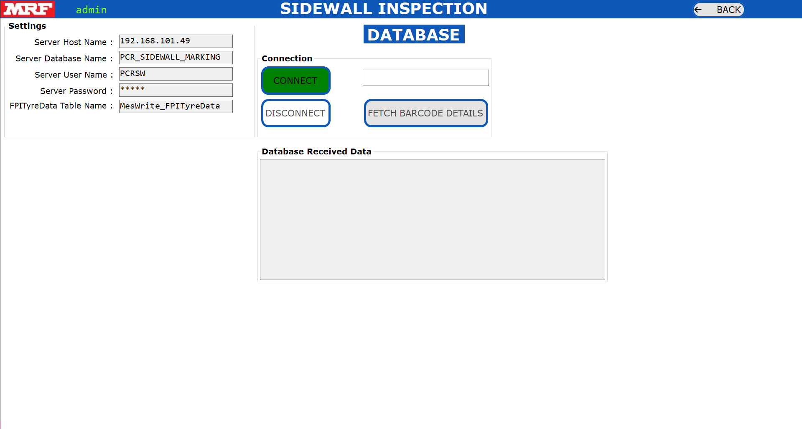 

##**3.MAINTENANCE and TROUBLESHOOTING**

***Maintenance :***

•	The inspection results are stored in the 'Data Location' folder.

 Please ensure that at least 25% of free space is always available on the respective drive.

•	If less than 5% of free space is available on the application installation drive (ideally the C drive) or on the 'Data Location' folder drive, the application will not open.

 ***TROUBLESHOOTING :***

•	There are three types of messages that will appear in a dialog box.

•	Information, Warning and Error

•	When an error occurs, delete the SKU with the error through SKU Management and create a new SKU for it.

•	Please read the camera user manual carefully for troubleshooting instructions.